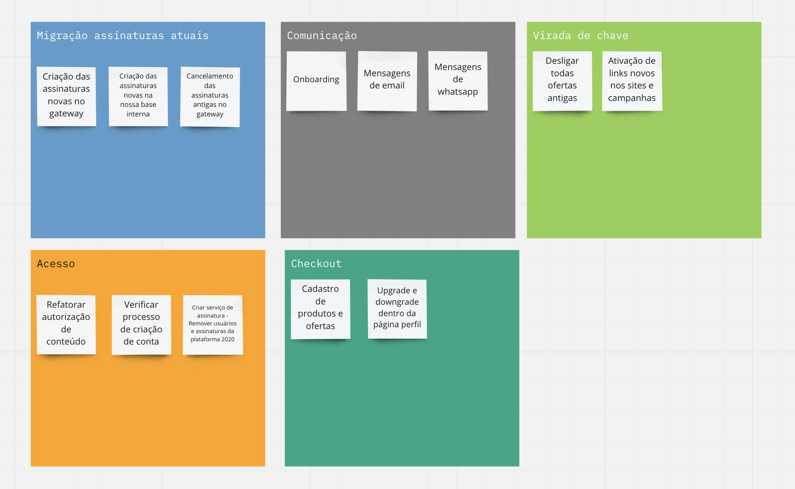

# GBB Subscription Model Transformation — Shape Up Pitch

## Strategic Problem

BP had 15+ subscription plans differentiated by content category with no upgrade path, no clear technology-based value proposition, and no upsell mechanic. The subscription model was a ceiling on growth.

See [01-problem-framing.md](./01-problem-framing.md) for detailed context on the 15+ SKU problem, why it mattered, and who was affected.

**Proposed solution:** Use technology as the differentiator instead of content — single screen (Good), multi-screen + downloads (Better), all features + high resolution (Best).

---

## Appetite & Scope

**5 months across 3 Shape Up cycles, 4 concurrent squads.**

This is a program, not a single project. It spans three concurrent work streams:

1. **Cycle 1 (April – June 2022): Subscription Infrastructure** — rebuild webhook processing, user/subscription creation service, Mundipagg → Guru migration
2. **Cycle 2 (June – August 2022): Migration Logic** — subscriber mapping algorithm, incremental rollout process, communication strategy for 335k members
3. **Parallel (May – September 2022): Prerequisite Product Work** — Mobile Player (DRM), Media Downloads, Subscription Self-Management

The program outcome depends on sequencing and dependency management across all four work streams.

---

## Cycle 1: Subscription Infrastructure

**Goal:** Rebuild the subscription creation pipeline from Mundipagg (legacy) to Guru (new payment engine).

**Architecture:** Event-driven subscription processing with a notification service (receives + stores encrypted backup), event classifier (maps to internal types), and subscription service (creates/updates users).

**Key decisions:**
- Encrypted backup store for all incoming notifications (LGPD compliance + replay capability)
- Complete audit trail: every subscription state change traceable to its source event
- Feature flag to switch between old and new flows without big bang cutover

This layer must be live and stable before the migration cycle can begin — every migrated subscriber's billing depends on it.

---

## Cycle 2: Migration Logic

**Goal:** Migrate ~335k live subscribers to GBB tier structure without disrupting billing, access, or member experience.

**Expected distribution:**
- Good: ~251,392 (mapped from Patriota, Fundadores, etc.)
- Better: ~20,205 (mapped from mid-tier plans)
- Best: ~64,037 (mapped from BP Select, Premium, Acesso Total)

**Edge cases requiring explicit resolution:**

| Scenario | Population | Resolution |
|----------|-----------|------------|
| Members with duplicate subscriptions | ~5,000+ | Keep most recent paid; cancel others |
| Founders with additional paid plans | ~3,230 | Map to Good; protect R$2.6M (~A$730K at 2022 rates) ARR |
| Mecenas (premium donors) | ~1,042 | Maintain locally; don't touch Guru |
| Unactivated gift cards | ~9,000 | CS action or refund |
| Manual/promotional subscriptions | ~3,598 | Include in mapping |

**Migration algorithm:** For each subscriber: get all active subscriptions, apply mapping rules, select latest paid subscription to keep, cancel others, update plan.

**Communication:** Two tracks — personalized email for existing members 7 days before renewal (showing their tier), new checkout flow for new members (GBB only).

---

## No-Goes

- Trial eligibility for migrated users (deferred — flagged for post-migration follow-up)
- Automated paused-subscription handling (handled manually in v1)
- Hotmart subscriber automated migration (separate resolution track)
- Self-serve plan change at migration time (shipped separately as Subscription Self-Management 1.0)

---

## Rabbit Holes

- **Payment engine cutover timing:** Mundipagg subscriptions processing mid-cycle would land in Guru in an inconsistent state if the cutover wasn't sequenced correctly. Solution: feature flag with a defined cutover moment tied to a monitored rollout.
- **Duplicate subscription logic:** Members with multiple subscriptions for the same plan were more common than expected (~780 bp-select duplicates alone). Mapping algorithm had to handle this explicitly.
- **Founders:** ~12k founders, ~3,230 with additional paid plans generating R$2.6M (~A$730K at 2022 rates) ARR. Their migration had to be handled with care — wrong mapping could trigger unexpected billing changes on high-value accounts.
- **Renewal-time race condition:** The subscriber base is dynamic. A member's state at migration time might differ from their state at last data pull. Migration was designed to run against live subscription state, not a snapshot.
- **Access continuity:** If a migrated member hadn't yet consumed a feature that's now in their tier (e.g., downloads becoming available for Better members), their access should expand, not contract. Required explicit validation that tier upgrades never reduced access.

---

## Success Criteria

| Metric | Target |
|--------|--------|
| Subscribers migrated | ~335k (entire active base) |
| Access complaints post-migration | < 0.5% of migrated base |
| Billing disruptions | 0 |
| Old plan SKUs retired | 15+ → 0 |
| Duplicate subscriptions resolved | All identified |

---

See [03-delivery.md](./03-delivery.md) for the key execution decisions that made this program work.
