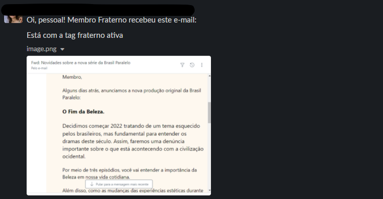

# CRM and Contact Data Overhaul — Data Governance and Campaign Orchestration

**Brasil Paralelo · 2022 · Shape Up Big Batch (6 weeks)**

---

## Problem

Three separate outreach tools run by three different teams were sending the same member approximately 4 messages per week with 58% list accuracy and no frequency governance. Members were being over-communicated, unsubscribing, and escalating to CS. There was no single source of truth for contact data, no rules governing which campaign took priority, and no way to measure whether outreach was actually driving engagement or damaging retention.

---

## My Role

Sole PM. Reframed the problem, designed the data architecture, and defined the governance rules before engineering started.

---

## Key Decisions

**1. Reframed from "Marketing ops request" to "data governance and member experience problem"**

Marketing originally framed this as a tooling request: they wanted better email send capabilities. I reframed it as a data governance and member experience problem — the root cause was fragmented contact data and zero frequency governance, not inadequate send tools. This changed the stakeholder map (brought in Data and CS) and expanded the solution scope from a marketing tool to a platform capability.

**2. BigQuery batch over Kafka streaming for v1**

The architecture choice was between real-time streaming (Kafka) and batch processing (BigQuery). Email campaigns don't require sub-second latency — they run on daily or weekly cadences. I chose BigQuery for v1 because the complexity reduction was significant: no stream infrastructure to maintain, simpler debugging, and the data team could query the same tables directly. The tradeoff: no real-time triggering (e.g., instant re-engagement on page visit), but that was explicitly out of scope for v1.

**3. Freeze rule precedence defined before engineering started**

The hardest product question in campaign orchestration: when a member qualifies for two campaigns of the same type on the same day, which one wins? I defined the freeze rule precedence logic (priority ranking, frequency caps, cooldown periods) before engineering wrote a single line of orchestration code. This prevented the common trap of building the send engine first and the governance rules later.

**4. Centralised 1.5M contacts into BigQuery as single source of truth**

Rather than syncing between three separate tools, I consolidated all 1.5M contacts into BigQuery as the canonical data source. Tools could read from it but could not maintain their own divergent lists. This eliminated the 58% list accuracy problem at its root.

---

## Results

- Sends per member: **−54%** (from ~4/week to ~2/week)
- List accuracy: **58% → 96%**
- CS over-communication escalations: **−67%**
- First campaign re-engagement rate: **13.4%** vs **6.8%** historical baseline
- Behavioural lead generation engine operational, feeding segmented audiences to marketing

---

## Documentation

| Document | What it covers |
|----------|---------------|
| [01-pitch.md](./01-pitch.md) | Full Shape Up pitch: problem with data, appetite, solution architecture (BigQuery, freeze rules, lead engine), rabbit holes, no-goes, and measured outcomes |
