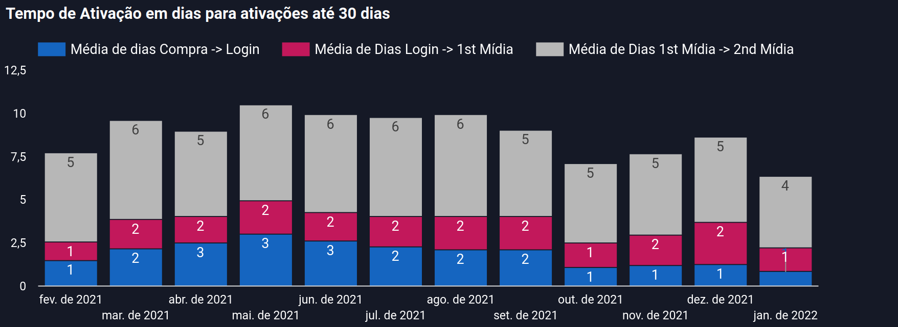

# Purchase Flow 1.0 — Discovery & Project Setup

## Problem Framing (Initial Analysis)

The activation gap was identified through cohort analysis in Firebase and Data Studio. Key findings that shaped the project:

- ~15% of new paying members never logged in after purchase (full-year 2021 data)
- The purchase funnel was effectively opaque: no data was captured until the user completed the Guru (payment processor) checkout in full
- Mobile had no native purchase path — non-members were sent to a desktop-optimized external portal
- The onboarding sequence involved up to 5 context switches (platform → email → portal → WhatsApp → back to platform)

The data made a clear case: the problem wasn't acquisition volume, it was activation failure converting paying customers into active users.

---

## Solution Direction (Consensus)

After mapping every user registration state (new vs. existing user, web vs. mobile, trial vs. direct purchase), the team aligned on four design principles:

1. **Move registration barriers to post-purchase** — reduce friction on the path to payment
2. **Capture lead data before checkout** — even an email address from an abandoned checkout has value
3. **Close the loop automatically after payment** — redirect members to the platform with auto-login, eliminating the post-purchase email dependency
4. **Build a testable foundation** — A/B infrastructure to iterate on the flow over time

---

## Key Decisions

| Decision | Chosen Path | Rationale |
|----------|------------|-----------|
| Trial model | Opt-Out (purchase → cancel window) | Guru doesn't support card validation for Opt-In trials |
| Checkout ownership | Keep Guru as payment processor | Replacing Guru was out of scope and appetite |
| Mobile purchase path | Landing page redirect (iOS) / Email (Android) | Apple and Google App Store policies restrict alternative checkout flows |
| Password setup timing | Embedded in post-checkout flow | Eliminates reliance on transactional email for activation; reduces one context switch |
| A/B testing | Infrastructure-level, not experiment-specific | Investment in a reusable framework, not a one-off test |

---

## Open Questions Resolved Before Kickoff

- **Data handoff to Marketing:** Lead data captured pre-checkout could not be passed directly to Marketing as lists without LGPD compliance review. Agreed: data goes to the data lake; Marketing accesses via the BI layer, not direct export.
- **Direct URL access to mid-funnel steps:** Any user arriving at a checkout step directly (e.g., from a bookmark) is redirected to the start of the flow. No partial-state entry allowed.
- **Post-purchase for existing members:** If a member somehow re-enters the purchase flow, duplicate-purchase detection handles the case (graceful redirect to platform; refund if payment was captured).

---

## Architecture Notes

- Pre-checkout service must verify user state (new vs. existing vs. trial) against bp-plataforma 2020 before rendering the appropriate flow path
- Post-Guru redirect uses a polling mechanism to confirm payment confirmation before triggering auto-login
- Firebase events needed for full funnel visibility: `checkout_started`, `lead_captured`, `checkout_completed`, `login_post_purchase`
- A/B testing framework operates at the infrastructure layer — experiment variants are configured without code deploys
