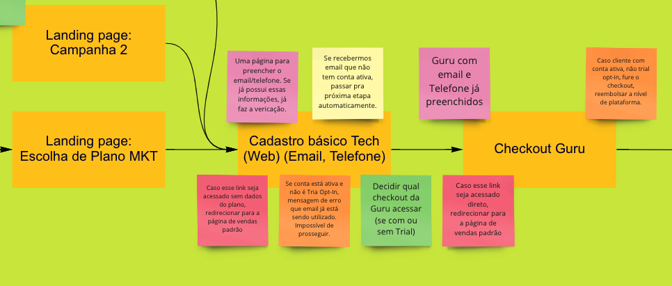
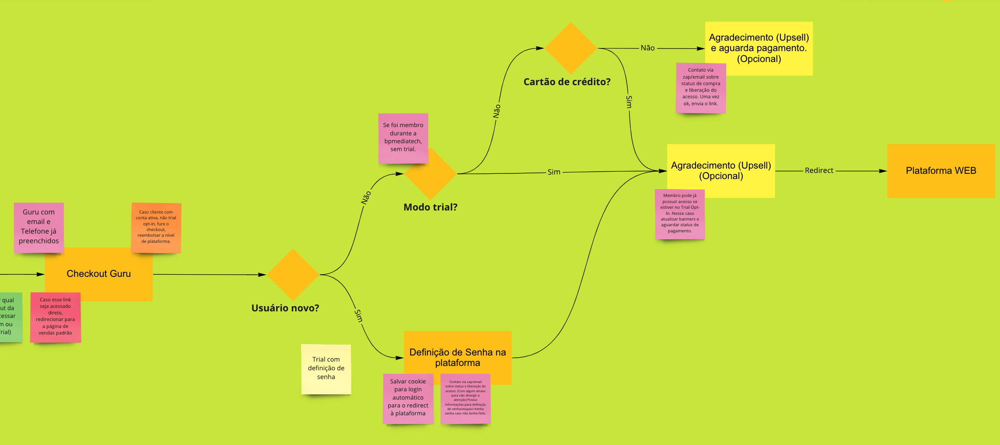
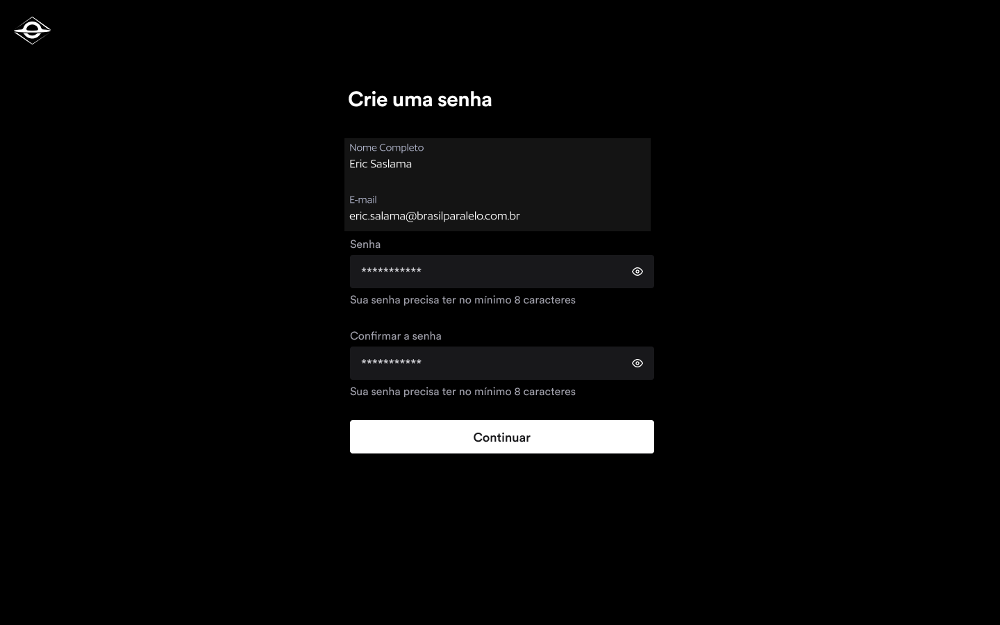
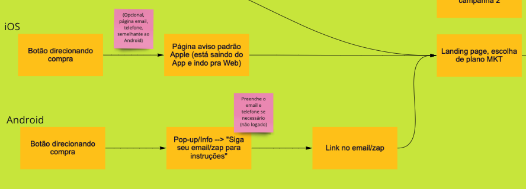

# Purchase Flow 1.0 — Pitch

## Problem

Three interconnected issues were degrading acquisition and early retention:

**1. No lead capture from incomplete checkouts**
The checkout required users to fill in name, email, phone, and CPF before any data was saved. Users who abandoned mid-funnel left no trace — no email, no phone, nothing for recovery campaigns. Even capturing just an email or phone number would enable cart abandonment flows.

**2. 15% of new members never logged in after purchase**
Post-purchase, members received a welcome email, were told to go to the platform, set a password, and log in — multiple context switches across platform, email, and WhatsApp. The result: ~15% of new paying members never activated.

> Source: Firebase Analytics / Data Studio, 2021 full-year data.

"I don't use it enough" was consistently the top cancellation reason. Members who never activated were at the highest churn risk — a direct line from a broken purchase flow to subscriber loss.

**3. No mobile purchase path**
Non-members on mobile had no way to purchase from within the app. They were redirected to an external portal — an experience designed for desktop, poorly adapted for mobile — creating significant drop-off at the moment of highest purchase intent.

---

## Appetite

**Big Batch — 6 weeks**

| Role | Allocation |
|------|-----------|
| 2 backend engineers | Full-time |
| 1 mobile engineer | Small batch |
| 1 data engineer | As needed |

The project delivers three independently releasable parts:
1. Pre-checkout pages (lead capture + user check)
2. Post-checkout pages (password setup, auto-login)
3. A/B testing infrastructure for web

---

## Solution

**Trial Opt-Out model** — user purchases and may cancel within an expiration window, rather than requiring a free trial pre-purchase (Trial Opt-In). *Note: Guru (payment processor) does not validate cards for trial mode, which ruled out Opt-In for this cycle.*

### Pre-checkout flow (Web)

New pre-checkout step collects lead data (name, email, phone) before redirecting to Guru checkout. This data is saved as a lead regardless of whether the user completes payment.

### Post-checkout flow (Web)

After successful payment, users are redirected directly to the platform with auto-login where possible. For new users, a password-definition step is included in-flow (no email required).

### Mobile flow

Mobile users who click a purchase CTA are redirected to a landing page (iOS) or receive an email (Android). Dedicated mobile registration path introduced for first-time users.

### Full solution flowchart

**Design references:**
- [Figma Web (Signup & Onboarding)](https://www.figma.com/file/63GGTBfYPGOwdQYDEHas66/22Q2-Signup-%26-Onboarding)
- [Figma App](https://www.figma.com/file/H1vs2zz3iOyqDDjpdzikcL/BP-Mediatech-Prototipação-Master?node-id=101%3A13862)
- [Miro — Checkout flow](https://miro.com/app/board/uXjVOBIrhuY=/)
- [Miro — Trial flows](https://miro.com/app/board/uXjVO7KlNJg=/)

---

## No-Goes

- Integrated (native) checkout — Guru checkout is kept as-is
- In-app checkout on mobile
- Trial Opt-In (deferred due to appetite and Guru limitations)
- Cross-sell / upsell during checkout (separate initiative)
- Landing pages for promotional campaigns
- In-platform trial expiry banners ("welcome", "trial ending", "account expired")

---

## Rabbit Holes

- **Guru integration complexity:** Sending registration data to Guru pre-checkout and handling post-checkout redirect via polling required significant back-and-forth with Guru's API. Architecture diagram needed before committing to timelines.
- **A/B testing infrastructure:** Building a proper experimentation layer for web flows was a meaningful engineering investment that needed scoping before shipping.
- **Lead-to-marketing handoff:** Needed alignment with Marketing on how captured leads would be used — legal/data compliance and CRM integration were open questions at pitch time.

---

## Success Metrics

| Metric | Direction | Rationale |
|--------|-----------|-----------|
| First-login rate (new members) | ↑ from ~85% baseline | Core activation problem |
| Lead capture rate (incomplete checkouts) | New metric (from 0) | Enables abandonment recovery |
| Mobile purchase conversion | New metric | New capability |
| A/B test win rate on checkout variants | Directional | Framework validation |

---

## What Shipped

- [x] A/B testing infrastructure for web checkout flows
- [x] New web registration flow with pre-checkout lead capture
- [x] New mobile registration / purchase entry flow
- [x] Post-checkout auto-redirect and auto-login
- [x] Password-setup step embedded in post-checkout flow
- [x] Redirect-guard: direct access to any mid-funnel step redirects to flow start

---

## Future Iterations

- Post-purchase email with password setup link (time-delayed, for users who skip the in-flow step)
- Email pre-fill when a user arrives via a marketing email link
- Automatic duplicate-purchase detection and refund handling
- Admin panel link generator for promotional landing pages

---

## Outcomes

**Measurement window: 60 days post-launch (August – September 2022)**

| Metric | Before | After | Change |
|--------|--------|-------|--------|
| First-login rate (new members) | ~85% | ~93% | **+8pp** |
| Lead capture from incomplete checkouts | 0 | 2,800+ leads | **New capability** |
| Mobile purchase path | None | Live (iOS + Android) | **New capability** |

**Notable results:**
- The 8pp improvement in first-login rate translated directly into a measurable reduction in early churn: members who activate within 24 hours of purchase have significantly higher 30-day retention.
- 2,800+ leads captured in the first 60 days from users who started checkout but didn't complete — a net-new pool for Marketing's re-engagement campaigns that previously didn't exist.
- Marketing ran the first cart abandonment email sequence within the same quarter, targeting captured leads with a 7-day window. Early response rates validated the value of the lead capture investment.
- A/B testing infrastructure deployed and used for 2 subsequent checkout experiments in Q3 2022, establishing a reusable experimentation foundation.
