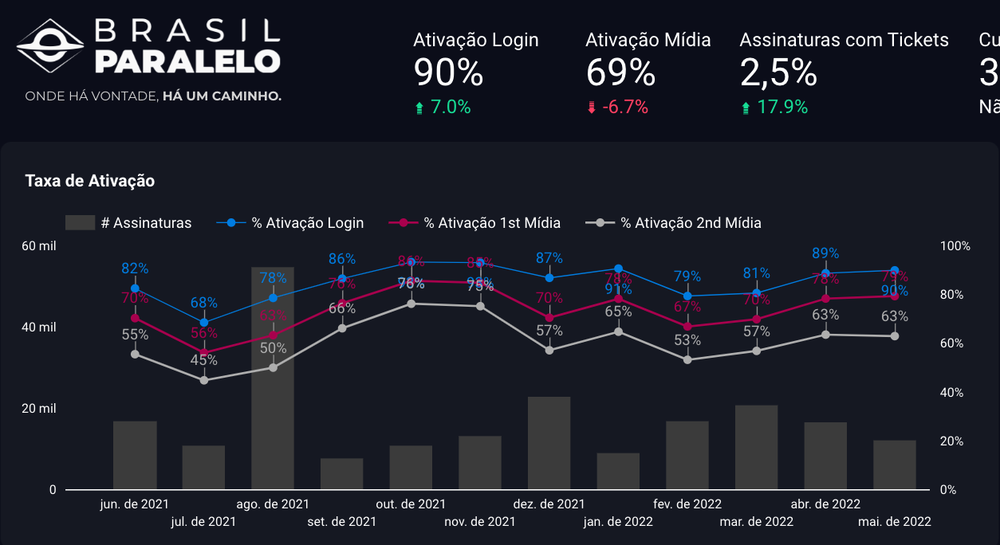
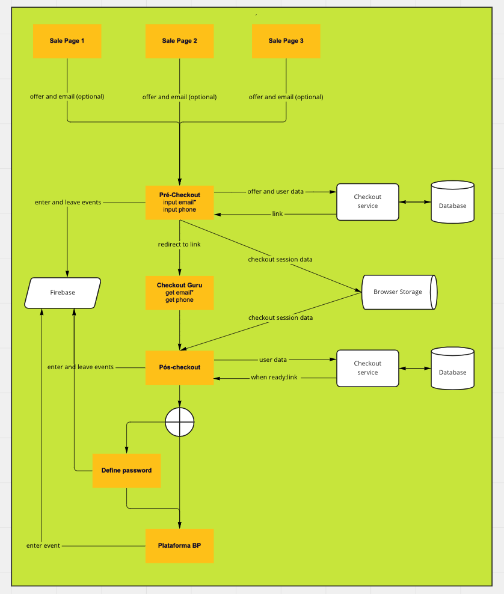

# Purchase Flow 1.0 — Acquisition Funnel Rebuild

**Brasil Paralelo · 2022 · Shape Up Big Batch (6 weeks)**

---

## Problem

~15% of new paying members never logged in after purchase, and BP had zero data from any abandoned checkout. The existing funnel required all registration data before saving anything — every abandoned checkout was invisible. Post-purchase, members navigated a 5-step activation sequence across multiple platforms. Mobile had no purchase path at all.

---

## My Role

Sole PM. Led discovery, framing, and delivery of the complete purchase flow redesign across web and mobile.

---

## Key Decisions

**1. Framed the 15% no-activation rate as a retention problem, not acquisition**

Members who never activate churn faster, compounding LTV impact. This reframing changed how the project was prioritised: it was no longer about conversion optimisation but about protecting downstream revenue. The tradeoff: broader scope than a simple checkout redesign.

**2. Trial Opt-Out over Opt-In**

Based on Guru's (payment provider) technical constraints, I chose Trial Opt-Out — users start a trial automatically and must cancel to avoid billing. Documented the tradeoff explicitly: higher conversion but potential for negative sentiment from users who forget to cancel. The decision was data-informed by industry benchmarks showing Opt-Out consistently outperforms Opt-In for subscription products.

**3. LGPD-compliant lead capture via data lake**

Marketing wanted direct access to abandoned checkout data. I negotiated a data-lake-first approach: lead data flowed into BigQuery first, with Marketing accessing it through governed queries rather than raw exports. This satisfied LGPD compliance requirements while still giving Marketing the data they needed. The tradeoff: slower initial setup for Marketing but a compliant, scalable architecture.

**4. A/B testing infrastructure as platform investment**

Rather than building one-off testing for this project, I scoped A/B testing infrastructure as a reusable platform capability. This added scope to the initial delivery but paid off in 2 subsequent experiments that same quarter.

---

## Results

- First-login rate: **85% → 93%** (+8pp)
- **2,800+** leads captured from abandoned checkouts (from zero)
- Mobile purchase path launched for the first time
- A/B testing infrastructure reused in 2 subsequent experiments

---

## Documentation

| Document | What it covers |
|----------|---------------|
| [01-project-setup.md](./01-project-setup.md) | Discovery and project setup: problem framing analysis, solution direction consensus, key decisions, and architecture notes |
| [02-pitch.md](./02-pitch.md) | Full Shape Up pitch: problem with data, appetite, solution, rabbit holes, no-goes, success metrics, and measured outcomes |
