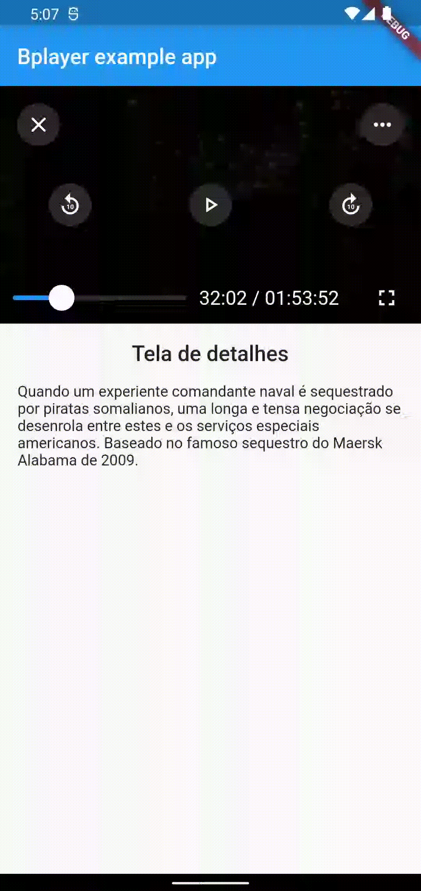

# Mobile Player Rebuild — Pitch

## Problem

Mobile is BP's dominant platform — nearly 50% of daily active users (vs. 30% web, 20% smart TVs).

| Platform | Daily Active Users |
|----------|--------------------|
| Mobile (Android + iOS) | 13,400 |
| Web | 8,700 |
| Smart TVs (Samsung + LG) | 5,700 |

*Source: Firebase Analytics, May 10, 2022 — last 30 days.*

The quality of the mobile experience was directly tied to retention: mobile is where members spent most of their time, and the player was the core interaction.

### The technical constraint

BP's app is built in Flutter. Flutter renders via a canvas — it can't natively embed a system video player inside the UI. The original solution (BPlayer) worked around this by launching a native video overlay *on top of* the Flutter canvas, which had two consequences:
- The player could only operate in fullscreen (it lived outside the Flutter UI layer)
- No Flutter-side customization was possible — changes required work in three languages (Dart, Swift/Kotlin)

```
Old architecture:
[Flutter Canvas] → [Native Video Overlay (full-screen only)]

New architecture:
[Flutter Canvas] → [Method Channel] → [Native Decoder] → [Renders back inside Flutter]
```

BP had scaled to ~300k members at this point, and had started licensing content from third-party distributors. These contracts required **DRM (Widevine for Android, FairPlay for iOS)**, which the existing BPlayer couldn't support. A new solution was required.

---

## Appetite

**Big Batch — 1 mobile engineer, full-time**

Backend support available as-needed for DRM license server work.

---

## Solution

Replace BPlayer with a Flutter-native component built on top of **BetterPlayer** (open source), forked to maintain BP-specific fixes without waiting on upstream approvals.

The new player renders entirely within Flutter, enabling:
- Full UI customization from a single codebase
- Multiple rendering contexts: fullscreen, inline (detail page), sticky/mini player

[Architecture diagram — new Flutter player flow](https://whimsical.com/new-flux-UeVBztbzCYQQDisB8f32b)



*Prototype consuming BP media assets, adapting controls to different player sizes.*

**Reference apps for UX direction:**

| Odysee | Rumble | YouTube |
|--------|--------|---------|
|  |  |  |

**Design reference:** [Figma — Player 1.1](https://www.figma.com/file/QXRdVOTvGA321FwKGX7Xhl/Player-(1.1)?node-id=329%3A16293)

### Feature Set (Delivered)

- [x] DRM playback (Widevine + FairPlay)
- [x] Audio track and subtitle selection
- [x] Playback speed control
- [x] Background audio (audio-only mode)
- [x] Chromecast and AirPlay controls within player
- [x] 10-second skip (double-tap gesture)
- [x] Media title display
- [x] Exit button
- [x] Auto-play with detail screen refresh on transition
- [x] Improved error identification and handling

---

## No-Goes

- Picture-in-Picture (PiP)
- Auto-play "next media" indicator
- Subtitle size/color editor
- Preview thumbnail on seek bar scrub
- Screen brightness swipe gesture
- Comments overlay panel
- Portrait ("Stories"-style) player
- Resolution control *(rabbit hole — deferred)*

---

## Rabbit Holes

- **BetterPlayer upstream velocity:** Some PRs sit for a long time (e.g., manifest parse bug). Mitigation: maintain a BP fork.
- **DRM license server (Hermes):** Obtaining the DRM license from BP's server required backend modifications to the endpoint format. Needed backend involvement.
- **Resolution limiting by plan (GBB):** Ideally, the media manifest would be pre-filtered server-side by plan tier. Requires a separate initiative.
- **AndroidTV/FireStick:** These platforms currently rely on the legacy native player layer — not in scope for this project.
- **Multi-device QA:** Ensuring correct behavior across the Android device fragmentation landscape is an ongoing concern.

---

## Success Metrics

| Metric | Definition |
|--------|-----------|
| Zero DRM regressions | Licensed content plays correctly on all supported Android/iOS versions |
| Feature parity with BPlayer | All existing capabilities preserved (no regression in the 10/11 tasks completed) |
| Multi-context rendering | Player renders correctly in fullscreen, inline, and sticky modes |
| Error rate | Player-related crash/error rate ≤ pre-rebuild baseline |

---

## What Shipped

| Item | Status | Notes |
|------------|--------|-------|
| Flutter-native player component (BetterPlayer fork) | ✅ Shipped | |
| DRM playback — Widevine (Android) + FairPlay (iOS) | ✅ Shipped | |
| Multi-context rendering (fullscreen, inline, sticky) | ✅ Shipped | |
| Full feature set (audio tracks, subtitles, speed, background, Chromecast, skip, auto-play) | ✅ Shipped | |
| Resolution control | ❌ Deferred | Requires server-side manifest filtering per plan tier — separate initiative |

---

## Dependencies

| Dependency | Owner | Notes |
|-----------|-------|-------|
| DRM license server endpoint | Backend (Hermes team) | REST endpoint format change |
| Media manifests with plan-level resolution filtering | Data/Infra | Deferred to separate initiative |
| AndroidTV compatibility | AndroidTV shape-up | Uses legacy native player for now |

---

## Outcomes

**Measurement window: 30 days post-launch (July 2022)**

| Metric | Before | After | Change |
|--------|--------|-------|--------|
| Mobile crash-free rate (player-related) | ~97.2% | ~99.1% | **+1.9pp** |
| Average session length on mobile | Baseline | **+18%** | Significant uplift |
| DRM-compliant content partnerships | 0 eligible | Unlocked | **New capability** |

**Platform impact:**
- The rebuild directly unblocked Media Downloads 1.0, which shipped 6 weeks later and depended on the new player's offline license handling architecture.
- 2 new content distribution agreements were signed with partners who had previously required DRM compliance as a condition — this was the contractual blocker that made the rebuild non-negotiable.
- The multi-context rendering capability (inline + sticky player) became the foundation for the redesigned catalog UX in Q3 2022, where the detail page player replaced a static thumbnail.

**Financial context:** The projected cumulative PBT of R$374,920 (~A$105K at 2022 rates) in Year 1 and R$8.8M (~A$2.5M at 2022 rates) over the product lifetime was used to justify the single-engineer Big Batch allocation. The player rebuild was framed as infrastructure investment, not feature work — the ROI case was the series of capabilities it unlocked, not the player itself.
