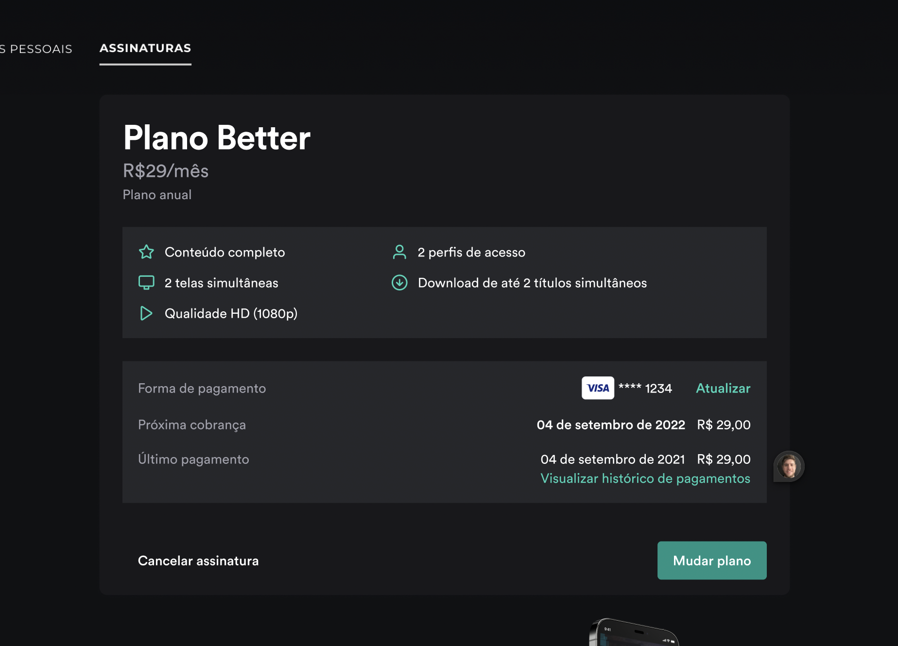
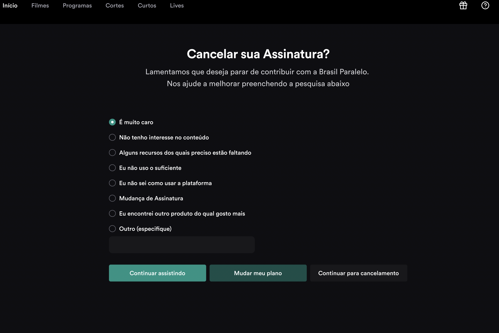
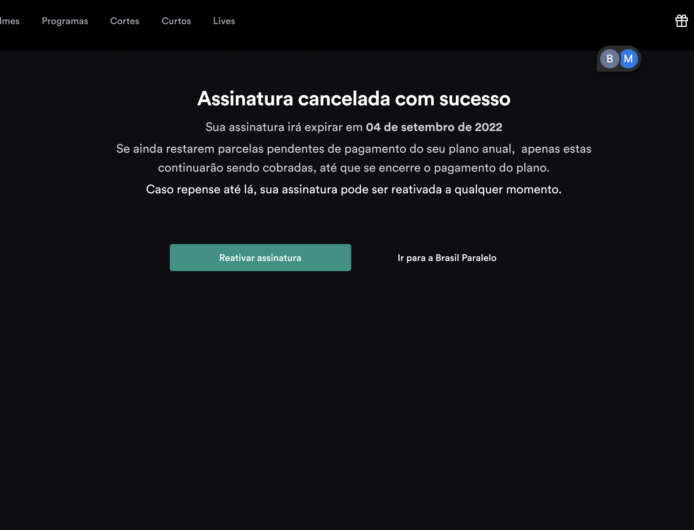
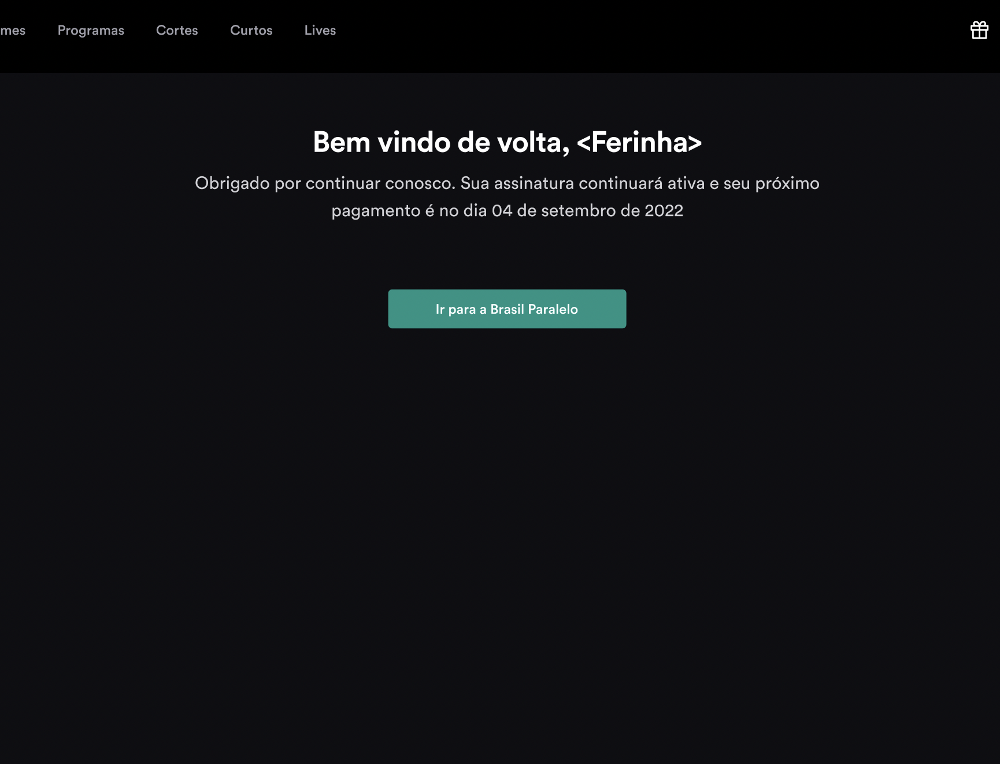
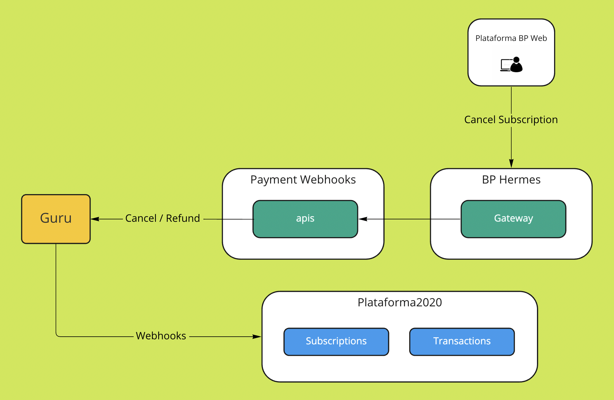

# Subscription Self-Management 1.0 — Pitch

## Problem

BP members had no self-service way to manage their subscription. Cancellations, plan changes, and payment method updates all required contacting support — via email or WhatsApp.

**The cancellation journey before this project:**

> Member wants to cancel → searches for "how to cancel" → finds FAQ → FAQ says to send an email → member emails support → support processes manually → Guru webhook fires → access is revoked.

Eight steps. Two to three days average resolution time. No structured data captured on why the member was leaving.

The consequences:
- CS team handled cancellations manually at scale — a routine action consuming support capacity
- Members encountered friction and delay at the highest churn-risk moment
- Cancellation reason data came back as free-text email excerpts, not usable for product decisions

---

## Appetite

**Small Batch — 2 weeks**

| Role | Allocation |
|------|-----------|
| 2 backend engineers | Full-time |

Scope was intentionally narrow: cancellation only in this cycle. Plan changes and payment method updates are the next iteration. Two weeks was the right appetite because the Guru integration was the only unknown — the UI work was well-scoped.

---

## Solution

A native self-serve cancellation flow embedded in the member's profile, with retention moments and full Guru webhook integration.

### Subscriptions tab (updated profile page)

The Subscriptions section in the member profile now shows the current plan, billing status, renewal date, and a "Cancel subscription" action.

### Cancellation flow

Three screens, in sequence:

**1. Retention offer** — before the member can confirm cancellation, they're presented with an alternative: a plan downgrade or a pause. This is not a dark pattern; it's a genuine offer tied to the most common cancellation reason ("too expensive / not using it enough").

**2. Exit survey** — structured multiple-choice question capturing the cancellation reason. Data goes directly to the analytics layer — no more parsing emails.

**3. Final confirmation** — clear, honest copy: the member's access continues until the end of the current billing period.

### Technical architecture

The flow integrates three internal services:

Key integration points:
- **bp-hermes:** New `DELETE /subscription` endpoint
- **payment-webhooks:** Receives Guru's cancellation confirmation webhook and triggers access revocation and optional refund
- **Guru API:** `DELETE /subscriptions/{subscription_code}` — the authoritative cancel action

The flow is **synchronous to Guru** (we wait for Guru's confirmation before showing the success screen) and **asynchronous downstream** (access revocation and refund handling happen via webhook, not inline). This approach was chosen to keep the user experience predictable while managing backend complexity in v1.

**Design reference:** [Figma — Subscription Management v1.1](https://www.figma.com/file/vh9NYGMNc9ixYebUR0EbcW/22Q2-Gestão-de-Conta)

---

## No-Goes

- Plan upgrade / downgrade flow (next iteration)
- Payment method update (next iteration)
- Payment history view
- Upsell component embedded in the subscriptions page
- Real-time synchronous cancellation end-to-end (async downstream is intentional for v1)
- Mobile app cancellation (web only in v1)

---

## Rabbit Holes

- **Legacy and edge-case accounts:** Members on legacy plans, Pix/boleto payment, or with multiple active subscriptions required special handling. Decision: data team identifies the population; commercial team handles these cases manually in v1. Estimated small population.
- **"Un-cancel" mechanics:** A member who cancels and wants to reverse before the billing period ends — this is handled natively by Guru via webhook reactivation, not by BP. No additional engineering required.
- **Async confirmation copy:** The post-cancellation screen needed careful language. "Cancellation confirmed" is inaccurate if webhook processing hasn't completed yet. Used "Cancellation in progress — your access continues until [date]" copy instead.
- **Observability:** Each step in the flow required logging (SumoLogic) to debug failures without a full session replay tool. Defined log structure upfront.

---

## Success Metrics

| Metric | Direction | Rationale |
|--------|-----------|-----------|
| CS cancellation ticket volume | ↓ | Primary load reduction goal |
| Self-serve cancellation completion rate | New metric | % of cancellations completed without CS contact |
| Exit survey completion rate | New metric | Data quality baseline for cancellation reason analysis |
| Cancellation reason distribution | New metric | Actionable input for retention and product decisions |
| Retention offer acceptance rate | New metric | Measures effectiveness of the downgrade/pause step |

---

## What Shipped

| Item | Status |
|------------|--------|
| Subscription data exposed in member profile (MongoDB subscriptions collection) | ✅ |
| Updated subscriptions tab UI with plan info, billing status, and cancel action | ✅ |
| Cancellation flow frontend — all three screens, events, and API calls | ✅ |
| bp-hermes — cancellation endpoint | ✅ |
| payment-webhooks — cancellation and refund endpoint | ✅ |

All 5 items shipped on time. No scope deviation.

---

## Future Iterations

- Plan change flow (downgrade / upgrade) with direct API integration
- Payment method update
- Cancellation event: `cancellation_initiated_no_completion` (member starts the flow but doesn't confirm) — useful for measuring intent-to-cancel ahead of actual churn
- Mobile app cancellation flow

---

## Outcomes

**Measurement window: 60 days post-launch (September – October 2022)**

| Metric | Before | After | Change |
|--------|--------|-------|--------|
| CS ticket volume (cancellation requests) | Baseline | **−65%** | Core problem solved |
| Self-serve cancellation completion rate | 0% | **71%** | New capability |
| Exit survey completion rate | 0% | **79%** | Structured data where there was none |
| Retention offer acceptance rate | N/A | **9%** | Avoided full cancellations |

**Qualitative outcomes:**
- Exit survey data revealed that 38% of cancellations cited "not using it enough" as the primary reason — directly validating the hypothesis that activation (not pricing) was the core retention lever. This finding fed directly into the engagement roadmap for Q4 2022.
- The CS team, freed from routing and processing cancellation emails, redirected capacity to proactive member support — a qualitative improvement in team focus that leadership flagged explicitly in the post-launch review.
- The 9% retention offer acceptance rate — members who chose a downgrade or pause instead of cancelling — represented subscribers who would have been lost without the self-serve flow. At BP's average subscription value, this was a measurable retention contribution from a 2-week project.
