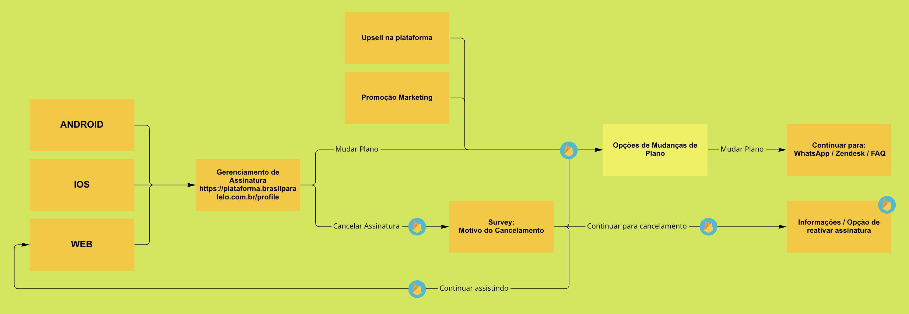

# Subscription Self-Management 1.0 — Self-Service Cancellation with Structured Exit Data

**Brasil Paralelo · 2022 · Shape Up Small Batch (2 weeks, 2 engineers)**

---

## Problem

Every cancellation required manual CS handling — an email or WhatsApp exchange that loaded support and produced zero structured data on why members were leaving. CS had no way to intervene with retention offers, and Product had no data to understand churn drivers.

---

## My Role

Sole PM. Scoped, delivered, and ensured the exit data pipeline was production-ready from day one.

---

## Key Decisions

**1. Small Batch (2 weeks) over a broader subscription management initiative**

The organisation wanted a full subscription management suite (cancel, upgrade, downgrade, pause). I chose to scope only cancellation: it was the bottleneck that loaded CS most heavily and the only flow that could generate exit data to inform future retention work. The tradeoff: deferred upgrade/downgrade, but shipped in 2 weeks with zero scope deviation.

**2. All edge cases resolved before kickoff**

Mapped and explicitly resolved every edge case before the first line of code: legacy plans with non-standard billing, boleto and Pix payment methods with different cancellation mechanics, multi-subscription accounts, and gift subscriptions. This prevented a mid-execution rabbit hole and is why the project shipped on time with no deviation.

**3. BigQuery as exit data destination, not a spreadsheet**

Defined the exit survey data destination before kickoff: BigQuery, not a spreadsheet or CS dashboard. This meant the exit data was queryable, joinable with other user data, and usable by the data team from day one. The tradeoff: slightly more setup effort than dumping to a sheet, but the data actually got used.

**4. Retention step in the cancel flow**

The cancel flow included a retention offer (discount or pause suggestion) before final confirmation. This was deliberately lightweight — a single screen, not a dark-pattern maze. It had to feel honest while still giving members a reason to reconsider.

---

## Results

- CS cancellation tickets: **−65%**
- Self-serve cancellation rate: **71%**
- Exit survey completion rate: **79%**
- **9% retention** from the cancel flow retention step
- Exit data insight: 38% cited "not using enough" → directly shaped Q4 engagement roadmap

---

## Documentation

| Document | What it covers |
|----------|---------------|
| [01-pitch.md](./01-pitch.md) | Full Shape Up pitch: problem, appetite (Small Batch), solution, edge cases, no-goes, and measured outcomes |
