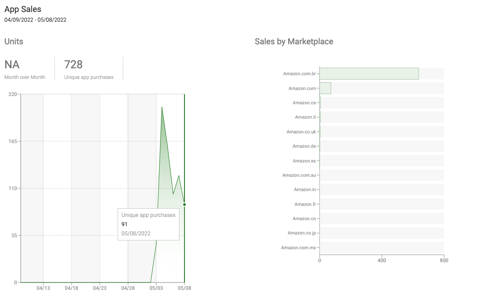

# Android TV — Pitch

## Problem

By early 2022, BP was live on mobile (Android + iOS), web, and two smart TV platforms (Samsung Tizen and LG WebOS). The next priority was **Android TV** — the OS powering Sony TVs, budget set-top boxes, and the dominant streaming device in Brazil's mass market: the **Amazon Fire TV Stick**.

Members had been requesting Android TV support for an extended period. The business case was straightforward: Android TV (plus Fire TV Stick) represented a large underserved base of existing members consuming content on their TVs through workarounds (casting, browser), plus a potential new acquisition surface in the budget TV segment.

*(Full market research deck: Graficos.pdf, internal)*

The opportunity was compounded by the fact that the Hebe codebase — the web-based TV UI already running on Samsung and LG — could be adapted for Android TV, avoiding a full native rewrite. The cost of not shipping was increasingly hard to justify.

---

## Appetite

**Big Batch** — 2 engineers, focused batch

Rather than build a native Android TV app from scratch, the strategy was to wrap the existing Hebe TV app in an Android WebView module. Hebe already powered the Samsung and LG experiences — porting to Android TV meant adapting the control scheme (D-pad navigation) and integrating the native BPlayer for video, not rebuilding a UI.

This approach let us ship fast and gather real usage data. A full native implementation was acknowledged as a future investment, not a current requirement.

---

## Solution

**Android module** with a WebView loading Hebe, bundled with the existing bp-athena mobile app as a single Play Store listing.

Key architectural decisions:
- **One app listing for mobile + TV** — users install once; the Play Store serves the appropriate experience based on device type
- **Native Android for the WebView module** — evaluated Flutter vs. native; native Android gave better WebView and player control
- **BPlayer for video** — video plays in the native layer, not inside the WebView, which ensured DRM compliance and maintained existing performance
- **JavaScript bridge** — communication interface between the Android module and Hebe for navigation events and player controls
- **D-pad navigation** — Hebe redesigned to support remote control input (directional navigation, select/back)
- **Shared CI/CD** with the mobile pipeline, with minor adjustments for the TV build variant

This architecture also meant parity with the Samsung/LG experience by default — one TV UI served across three platforms.

---

## No-Goes

- Full native Android TV app (WebView approach accepted for this cycle)
- In-App Purchase
- OS-level integrations: home screen search, "Continue Watching" recommendations feed
- Unsupported Android TV variants (gray-market, non-certified devices)

*Note: Amazon Appstore (Fire TV Stick) was initially treated as a separate follow-up submission. Given the overlap with Android TV, it was shipped in the same cycle.*

---

## Rabbit Holes

- **DPI/scale handling:** Android TV devices report a wide range of screen DPI values. Hebe required device-profile testing and layout adjustments to render correctly at TV scale.
- **Play Store split delivery:** Shipping mobile and TV in one APK required understanding how the Play Store handles separate device experiences within a single listing — version tracking, split APK delivery, and review criteria differ.
- **Amazon Appstore:** A completely separate submission process with its own review criteria, independent of Google Play. Both submissions required iteration before approval.
- **Analytics attribution:** Hebe (the web layer) fires events — confirming those events were correctly attributed to the Android TV context (not the web) required explicit validation.
- **Store rejection language:** Both Google and Amazon provided vague rejection messages. Resolving compliance issues was iterative, not deterministic — and having an internal contact at either company would have significantly reduced round-trip time.

---

## Success Metrics

| Metric | Definition |
|--------|-----------|
| Downloads (Google Play — Android TV) | Total installs on certified Android TV devices post-launch |
| Downloads (Amazon Appstore — Fire TV Stick) | Total installs on Fire TV devices |
| DAU on Android TV | Daily active users on the platform, segmented by Android TV context |
| Crash-free rate | Baseline crash-free rate for TV sessions ≥ mobile baseline |

---

## What Shipped

| Item | Status |
|------------|--------|
| Android module with WebView loading Hebe | ✅ |
| BPlayer integration for native video playback | ✅ |
| D-pad navigation adaptation in Hebe | ✅ |
| Bundled with bp-athena — single Play Store listing | ✅ |
| Google Play — gradual rollout to 100% | ✅ |
| Amazon Appstore (Fire TV Stick) | ✅ |

---

## Dependencies

| Dependency | Owner | Notes |
|-----------|-------|-------|
| Hebe (web TV app) | TV squad | Core UI layer — TV squad needed dedicated time on this |
| BPlayer | Mobile/TV | Video playback in native layer |
| Play Store review | Google | Bundled app approval required validation of device targeting |
| Amazon Appstore review | Amazon | Separate process, separate timeline |

---

## Outcomes

**Measurement window: 6 weeks post-launch (April – May 2022)**

| Metric | Result |
|--------|--------|
| Google Play downloads (Android TV) | **2,765** |
| Amazon Appstore downloads (Fire TV Stick) | **728** |
| Total downloads across both stores | **3,493** |
| Android TV DAU (week 6) | **~820 daily active users** |
| Android TV as % of total TV segment DAU | **~14%** (from 0% at launch) |

**Context on the numbers:** Gradual rollout to 100% of the eligible Google Play base was completed on April 21, 2022. The Amazon Appstore submission ran independently. Combined, Android TV/Fire TV Stick reached ~14% of BP's total smart TV DAU within 6 weeks of full availability — without any dedicated marketing push.

**Beta group:** A 52-person pre-launch beta tested the app over 2 weeks and surfaced 9 critical bugs before public release — including D-pad navigation edge cases and a media playback failure on a specific Sony TV firmware version that would have affected a meaningful portion of the addressable base.

**Strategic outcome:** The single app listing approach (mobile + TV bundled) validated itself: existing mobile members discovered the TV capability organically through the Play Store, without a separate install or announcement. This informed the decision to keep the same approach for future platform expansions.
