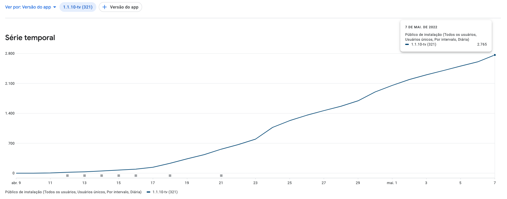

# Android TV — Platform Expansion via WebView Strategy

**Brasil Paralelo · 2022 · Shape Up Big Batch (6 weeks)**

---

## Problem

BP had no presence on Android TV or Fire TV Stick — the dominant low-cost TV hardware in Brazil — despite strong member demand. The TV segment represented ~5,700 DAU across Samsung and LG smart TVs, but the fastest-growing hardware segment (Android TV / Fire TV Stick) was completely unserved.

---

## My Role

Sole PM. Made the platform target case, chose the technical approach, and ran the pre-launch beta program.

---

## Key Decisions

**1. Android TV over competing platform targets**

Multiple platform expansion options were on the table (Roku, Apple TV, Samsung Tizen improvements). I made the case for Android TV using Brazil-specific market penetration data: Fire TV Stick was the fastest-growing TV hardware in the Brazilian market, and Android TV covered both Google Play and Amazon Appstore distribution in a single build. The tradeoff: no presence on Roku or Apple TV, but maximum market coverage per engineering effort.

**2. WebView wrapper over native rewrite**

The existing Hebe web-based TV app could be wrapped in a native Android WebView module and bundled with the mobile app, shipping to both stores in the same cycle. A native rewrite would have been technically superior but would have taken 3-4x longer. I chose WebView explicitly, with the technical debt acknowledged and accepted in the pitch. The tradeoff: performance limitations and some UX compromises versus shipping in 6 weeks instead of 18-24.

**3. Pre-launch beta with 52 participants**

Rather than shipping directly to production, I ran a structured beta with 52 members. This surfaced 9 critical bugs before public release, including a media playback failure on a specific Sony TV firmware that would have affected a significant portion of the target user base. The beta cost one week of calendar time but prevented a launch that would have damaged first impressions on a new platform.

---

## Results

- **3,493 downloads** across Google Play and Amazon Appstore in 6 weeks
- **~820 DAU** (~14% of the TV segment)
- **Zero marketing spend** — entirely organic adoption
- 9 critical bugs caught in beta before public release

| Google Play | Amazon Appstore |
|------------|----------------|
|  |  |

---

## Documentation

| Document | What it covers |
|----------|---------------|
| [01-pitch.md](./01-pitch.md) | Full Shape Up pitch: market analysis, appetite, solution (WebView strategy), rabbit holes, no-goes, and measured outcomes |
| [02-post-mortem.md](./02-post-mortem.md) | Post-launch retrospective covering what worked, what didn't, lessons learned, and process improvements for future platform expansion |
